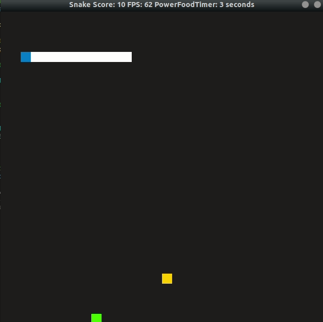
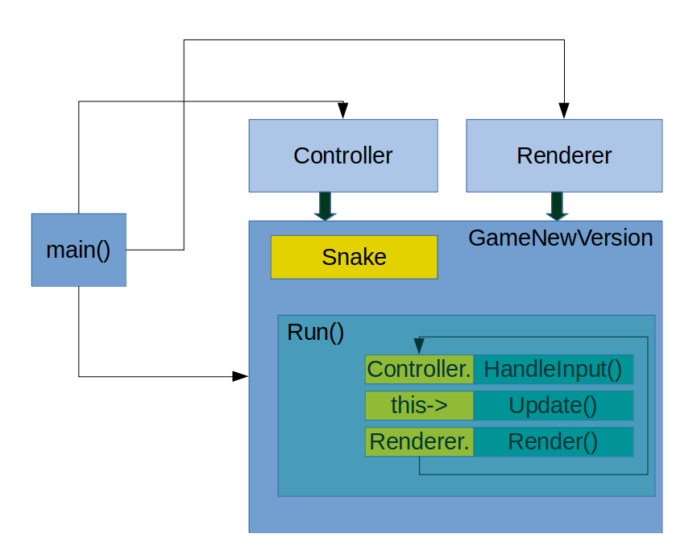

# CPPND: Capstone Snake Game Example

Initial version of the code was take from udacity capstone projet [Udacity C++ Nanodegree Program](https://www.udacity.com/course/c-plus-plus-nanodegree--nd213). The code for this repo was inspired by [this](https://codereview.stackexchange.com/questions/212296/snake-game-in-c-with-sdl) excellent StackOverflow post and set of responses.

## Dependencies for Running Locally
* cmake >= 3.7
  * All OSes: [click here for installation instructions](https://cmake.org/install/)
* make >= 4.1 (Linux, Mac), 3.81 (Windows)
  * Linux: make is installed by default on most Linux distros
  * Mac: [install Xcode command line tools to get make](https://developer.apple.com/xcode/features/)
  * Windows: [Click here for installation instructions](http://gnuwin32.sourceforge.net/packages/make.htm)
* SDL2 >= 2.0
  * All installation instructions can be found [here](https://wiki.libsdl.org/Installation)
  * Note that for Linux, an `apt` or `apt-get` installation is preferred to building from source.
* gcc/g++ >= 5.4
  * Linux: gcc / g++ is installed by default on most Linux distros
  * Mac: same deal as make - [install Xcode command line tools](https://developer.apple.com/xcode/features/)
  * Windows: recommend using [MinGW](http://www.mingw.org/)

## Basic Build Instructions

1. Clone this repo.
2. Make a build directory in the top level directory: `mkdir build && cd build`
3. Compile: `cmake .. && make`
4. Run it: `./SnakeGame`.# CppND-Capstone-Snake-Game

## Updates: 
* Initial version of the game had issue with placing the food, sometime the random generator would endup in location (32,y)/(x, 32) which will not be seen and hence the game become unplayable 

## New Feature:
* Added Power Food when consumed reduces the size of the snake by 3 and also reduces the speed by 0.04. The power food is placed when the score is multiple of 10 and has a duration of 10sec, after that it disappears
* Updated Window title to show the number of seconds left for power food
* 

## Code Structure:
* Main function creates object of Renderer, Controller and GameNewVersion class(old implementation had only Game class).
* Both Renderer and Controller are passed as reference object to GameNewVersion so that it can be controlled from inside the GameNewVersion.
* Controller handles the inputs received from keyboard and passes the control value to GameNewVersion.
* GameNewVersion class object updates the food position value and snake position value every cycle based on the control value passed by Controller object.
* Finally the updated position of snake and food is passed onto rendered object displaying on screen. 
* 

## Rubric Points Addressed:
* **Compile and runs**
   * Code Compiles and Runs without issue: The snake game code compiles without any error and without any runtime issue
* **Loops, Functions, I/O**
   * The project demonstrates an understanding of C++ functions and control structures: Class GameNewVersion has members functions that has control structures for running the snake game.
   * The project accepts user input and processes the input: Class Controller accepts inputs for processing in GameNewVersion class and  Renderer class displays it on screen.
* **Object Oriented Programming**
   * The project uses Object Oriented Programming techniques: All or many class in snake game uses encapsulation, data hiding, function overriding, inheritance(GameNewVersion)
   * Classes use appropriate access specifiers for class members: All class in snake game has correct specifers.
   * Class constructors utilize member initialization lists: All class constructor in snake game initialises its member variables using initialiser list
   * Classes abstract implementation details from their interfaces: Comments have been added at important locations
   * Classes encapsulate behavior: Appropriate data and functions are clubbed in there appropriate classes
   * Classes follow an appropriate inheritance hierarchy: GameNewVersion takes inheritance from the Game
   * Overloaded functions allow the same function to operate on different parameters. Renderer class member functions overloads Render function for Power Food
* **Memory Management**
   * The project makes use of references in function declarations: Rendered and Controller are passed as reference. There are also other places where the variables are passed by reference 
